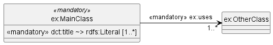
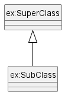

[](README.md)
[](README.en.md)

# PlantUML-To-Ontology

This tool takes a PlantUML file and converts it into another form. It was developed to create a, if possible complete, textual description of the Application Profile from the PlantUML file that represents the class model of DCAT-AP.de. 

This "model-driven design" approach reduces errors because changes to the model (in the PlantUML file) are automatically reflected in the documentation. This prevents, for example, a newly added property from appearing only in the documentation but not in the class model.

The repository comes with examples that include an overview ([examples/dcat-ap-de.plantuml](examples/dcat-ap-de.plantuml)) for the relatively complex Application Profile DCAT-AP.de ([templates/overview.hbs](templates/overview. hbs)), the data view of all classes and properties ([`templates/classes.hbs`](templates/classes.hbs)) and the change history ([`templates/changelog.hbs`](templates/changelog.hbs)).

The [Application Profile documentation](https://www.dcat-ap.de/def/dcatde/2.0/spec/) was created with this generator and [ReSpec](https://respec.org/docs/).

---

## Command line tool

"PlantUML-To-Ontology" (`p2o`) is a NodeJS command line tool that reads a PlantUML file, passes it to the templates and saves the result.

### Installation

The following must be installed: git, NodeJS and NPM.

> `git clone https://github.com/GovDataOfficial/plantuml-to-ontology.git`
>
> `cd plantuml-to-ontology`
>
> `npm install`

### Commands

> `node p2o.js <plantumlfile> [<template>...] [-e <extension>] [-o <output-dir>]`

At least the PlantUML file must be specified. Without further specification, all available templates will be used.

With `-e` the file extension of the generated files can be specified. Default is `.md`.

With `-o` the directory can be specified in which the generated files are stored. Default is `./output/`. The output directory must already exist, it will not be created by the tool.

> **Examples**
> 
> `node p2o.js examples/dcat-ap-de.plantuml`
>  
> `node p2o.js examples/mini.plantuml overview -e html`

### Analysis

> `node p2o.js examples/mini.plantuml analysis`

The analysis template ([`templates/analyse.hbs`](templates/analyse.hbs)) lists the contents of the ontology in a sorted manner. This makes it easy to get an overview of the classes, attributes and predicates used.

### JSON

> `node p2o.js examples/mini.plantuml json`

This command writes the data model generated by the grammar into the file `ontology.json`. If you start the tool without specifying the templates to be used, the JSON representation will not be generated. If you specify the templates to be used, you can add `JSON` if necessary.

---

## PlantUML Syntax

> [PlantUML](https://plantuml.com/) PlantUML is a component that allows you to quickly write class diagrams.
> Diagrams are defined using a simple and intuitive language.

In order to make the PlantUML class diagrams usable for further use, a Peggy grammar was written that can recognise a subset of the PlantUML syntax. 


### Class definition

```
class "ex:MainClass" <<mandatory>> #F8978D|FCFFFC {

}
```

The class consists of (from left to right):
- **Name**, mandatory. If special characters are used, inverted commas must be used. Since, as is usual in RDF, the namespace should be included, the `:` is practically always used.
- **Obligation level**, optional, enclosed in `<<`...`>>`.
- **Colouring**, optional. Hexadecimal code, introduced by `#`, where as in PlantUML colour gradients are possible via the special characters `-|\/`.
- **Class body**, optional. If the class has a class body, it may only be defined as shown. Other variants allowed by PlantUML are not supported.


### Predicate definition

By *predicate* we mean all RDF statements that are visible in the UML class diagram. The term comes from the [Resource Description Framework](https://www.w3.org/TR/1999/REC-rdf-syntax-19990222/#basic), whose statements are formulated as a triple of subject, predicate and object (`<s p o>`).

PlantUML has two types of predicates: those that are defined within a class and those that connect two classes of the ontology. A predicate **should not** be defined in both ways, as this is error-prone.

#### Predicates within a class


```
class "ex:MainClass" <<mandatory>> {
    <<mandatory>> dct:title ~> rdfs:Literal [1..*]
    <<recommended>> dct:modified ~> rdfs:Literal [0..1]
    <<optional>> ex:owns ~> ex:MainClass [0..1]
}
```

These predicates are specified in the class diagram in the class body. Their definition consists (from left to right) of five elements:
- **Obligation level**, optional, enclosed in `<<`...`>>`.
- **Name**, mandatory. Quotation marks may not be used As is usual in RDF, the name should contain its namespace. In the `<s p o>` statement, this is the predicate.
- **~>**, mandatory. This string is required to separate the predicate from the object.
- **Name of the object**, mandatory. In the `<s p o>` statement, this is the object. Quotation marks must not be used, as usual in RDF, the name of the object should contain its namespace. 
- **Cardinality**, optional, enclosed in `[]`. Minimum and maximum are separated by `..`. If the minimum and maximum cardinality are the same, it is sufficient to specify them once (e.g.: `[1]`). If the maximum cardinality is unlimited, `*` or `n` can be used.


#### Predicates between two classes


```
"ex:MainClass" -right-> "1..*" "ex:OtherClass" : <<mandatory>> ex:uses
```

These predicates are represented in the class diagram as a link between two classes. Their definition consists (from left to right) of five elements:
- **Name of the subject**, mandatory. Quotation marks are recommended. As usual in RDF, the name of the subject should include its namespace. 
- **-->**, mandatory. This string is needed to separate the subject from the rest of the statement. In PlantUML, only an arrow pointing from left to right (`-->` by default) may be used. To influence the layout of the visual representation, the length of the arrow may be varied. Directional words are also supported: `-left->`, `-right->`, `-up->` and `-down->`.
- **Cardinality**, optional, in quotes. Minimum and maximum are separated by `..`. If the minimum and maximum cardinality are the same, it is sufficient to specify them once (e.g.: `"1"`). If the maximum cardinality is unlimited, `*` or `n` can be used.
- **Name of the object**, mandatory. Quotation marks are recommended. As usual in RDF, the name of the object should include its namespace. 
- **Obligation level**, optional, enclosed in `<<`...`>>`.
- **Predicate name**, mandatory. Quotation marks are recommended. As usual in RDF, the name of the predicate should include its namespace.


### Attribute definition

Classes and predicates can be extended by attributes. These are not shown in the visualisation of the PlantUML file. Instead, they are additional information that is needed to transformation the data model into other forms of representation. 



```
class "ex:MainClass" <<mandatory>> {
    <<mandatory>> dct:title ~> rdfs:Literal [1..*]
        '@ rdfs:comment = Kommentar zu dct:title als Prädikat von ex:MainClass
}
'@ rdfs:label = Label von ex:MainClass


"ex:MainClass" -right-> "1..*" "ex:OtherClass" : <<mandatory>> ex:uses
    '@ rdfs:comment = Attribute können mehrfach vorkommen.
    '@ rdfs:comment = Z.B. für Zeilenumbrücke in Beschreibungen.
```

Attributes always refer to the preceding predicate or class. The attributes are key/value pairs defined as follows:
- **`'@`**, mandatory. While the apostrophe (`'`) marks a line as a PlantUML comment, ensuring that the file remains compliant, the `@` indicates that it is an attribute.
- **Tag**, mandatory. The key of the key/value pair.
- **`=`**, mandatory. Separates the label from the value.
- Value**, optional. The value of the key/value pair. Can be omitted if the value is empty.

### Sub- and super-classes



```
"ex:SubClass" -up-|> "ex:SuperClass"
```

Inheritance information is stored in the data model and displayed in PlantUML, but it does not automatically affect other areas. For example, if a subclass shall have all predicates of its superclass, this must currently be modelled explicitly. The definition requires the following information:
- **Name of subclass**, mandatory. Inverted commas are recommended. As usual in RDF, the subclass name should include its namespace. 
- **--|>**, mandatory. This string is needed to separate the subject from the rest of the statement. In PlantUML, only an arrow pointing from left to right (`--|>` by default) may be used. To influence the layout of the visual representation, the length of the arrow may be varied. Directional words are also supported: `-left-|>`, `-right-|>`, `-up-|>` and `-down-|>`.
- **Name of superclass**, mandatory. Inverted commas are recommended. As usual in RDF, the superclass name should include its namespace. 

---

## Grammar and data model

The PlantUML file is transformed into a data structure using a [Peggy grammar](src/p2o.peggy). The grammar is as minimal as possible and also works in the [online version](https://peggyjs.org/).


The data structure created by the grammar is used largely unchanged for the templates. The properties "`..._names`" are added at the level of `Ontology`, `Class` and `Predicate`. These are a list of the names of (unique) classes, attributes or predicates. This makes it easier, for example, to check for errors or to check whether a class has a certain predicate.

Classes are stored as objects in the `Ontology`, where the name of the class is also the key used to access the class. Therefore the class name must be unique. 

Attributes are also stored as objects in `Class` and `Predicate`. Access is via the attribute identifier. The value is always an array, so that an attribute identifier can also be used several times within a class or predicate.

### Error messages

If a class name is used more than once in the PlantUML file for initialisation, the previous version of the class is overwritten. In addition, an error message is stored in `Ontology.warnings`.

If an inheritance is defined for an unknown class, this class is created. In addition, an error message is stored in `Ontology.warnings`. The same happens if a predicate has an unknown class as domain or range.

These error messages help to find spelling mistakes or missing definitions in the model.

### Extension of the data model

If you want to add more properties to the classes, predicates or the ontology, for example to simplify the templates or to extend the functionality, this should be done in the respective module definitions ([`Ontology.js`](src/Ontology.js), [`Class.js`](src/Class.js) and [`Predicate.js`](src/Predicate.js)).

---

## Templates

[Handlebars](https://handlebarsjs.com/) is used as the templating engine. The `Ontology` object is passed to the templates. New template files must be placed in the folder `templates/`.

In the file [`generate.js`](src/generate.js) the following helper functions ([Handlebars helper](https://handlebarsjs.com/guide/#custom-helpers)) are defined:

Helper                   | Input        | Return   | Description
-------------------------|--------------|----------|----------------------------------
**`eq`**                 | v1, v2       | bool     | Checks whether `v1` is equal to `v2`.
**`ne`**                 | v1, v2       | bool     | Checks whether `v1` is not equal to `v2`.
**`lt`**                 | v1, v2       | bool     | Checks whether `v1` is less than `v2`.
**`gt`**                 | v1, v2       | bool     | Checks whether `v1` is greater than `v2`.
**`lte`**                | v1, v2       | bool     | Checks whether `v1` is less than or equal to `v2`.
**`gte`**                | v1, v2       | bool     | Checks whether `v1` is greater than or equal to `v2`.
**`and`**                | v1, v2       | bool     | Logical "AND" check between `v1` and `v2`.
**`or`**                 | v1, v2       | bool     | Logical "OR" check between `v1` and `v2`.
**`add`**                | v1, v2       | number   | Adds `v1` and `v2`.
**`lower`**              | v1           | string   | Converts `v1` to lower case.
**`upper`**              | v1           | string   | Converts `v1` to uppercase.
**`char1`**              | v1           | string   | Returns the first character of `v1`.
**`swap`**               | input, ...vN | string   | Searches `input` in the list of `vN`s and returns the value following `input`. See example/details.
**`join`**               | coll, text, ?uniq  | string | Connects all (possibly unique) elements of `coll` to the content of `text`. Necessary to e.g. create a string from the array of an `attribute` value. `uniq` is `false` by default. See example/details.
**`sort`**               | list               | list   | Sorts `list` alphabetically. It should be a collection of strings.
**`sortByName`**         | list               | list   | Sorts `list` alphabetically. Consider the name of the entries. Useful for classes and predicates whose name is taken directly from PlantUML.
**`sortByAttribute`**    | list, attribute    | list   | Sorts `list` alphabetically. To do this, look at the value of the attribute `attribute`.
**`sortByRequirement`**  | list, order        | list   | Sorts `list` according to the order specified in `order`. For this purpose, consider the liability taken directly from PlantUML as `requirement`. See example/details.
**`filterHasAttribute`** | list, attribute    | list   | Returns a list containing only elements that have an attribute named `attribute`.


**Example/Details for `swap`**
> `{{swap requirement "optional" "Optional" "recommended" "Empfohlen" "mandatory" "Pflicht"}}`
> 
> Here `swap` is used to convert the English entries of the binding into German expressions. 
> 
> For example, the value "recommended" is passed to the function as `requirement`. The return value is the entry that follows "recommended".
> 
> If the searched value is not found, the input value is passed unchanged.
>
> If the value found is the last value in the list, the first value in the list is returned. In the first example, this would not be a useful behaviour. However, it is useful, for example, if you want to determine the next month:
>
> `{{swap currentMonth "Jan" "Feb" "Mar" "Apr" "May" "Jun" "Jul" "Aug" "Sep" "Oct" "Nov" "Dec"}}`
>
> If "Dec" is passed here as `currentMonth`, "Jan" is returned as the next month.

**Example/Details for `join`**
> `join` matches the [JavaScript function](https://www.w3schools.com/jsref/jsref_join.asp) of the same name, but works for arrays as well as for objects. Applied to an object, all values of the object are joined.
>
> There are two typical use cases: 
> 
> **1)** `{{join cardinality ".." true}}`
>
> Creates from the cardinality `{min: 0, max:2}` the string `0..2`.
> 
> The cardinality `{min: 1, max:1}` will result in `1`, because of `true`. If you ommit `true` set the option to `false` (`{{join cardinality ".." false}}`), the result is `1..1`.
>
> **2)** `{{join (lookup attributes "rdfs:comment") "<br>"}}`
> Connects all entries of the `rdfs:comment` attribute with an HTML line break (`<br>`). 
> 
> Here `true` as the third parameter would remove duplicate values, e.g. several empty lines.

**Example/Details for `sortByRequirement`**
> The parameter `list` expects a list of objects that have the property `requirement`. This means predicates and classes. The parameter `order` is a string that specifies the desired order. The order is based on the first letter of the respective `requirement` entry.
> 
> `{{sortByRequirement predicates "orm"}}` thus starts with predicates whose `requirement` starts with `o`, followed by `r` and `m`. So first all "optional", then "recommended" followed by "mandatory".