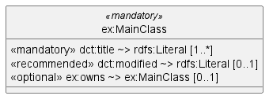
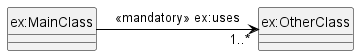
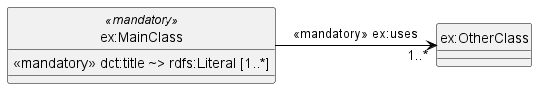
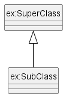
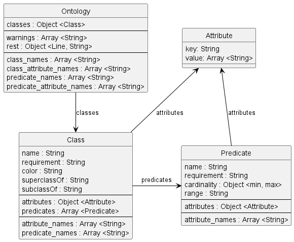

# PlantUML-To-Ontology

Dieses Tool nimmt eine PlantUML-Datei und wandelt sie in eine andere Form um. Entwickelt wurde es, um aus der PlantUML-Datei, die das Klassenmodell von DCAT-AP.de beschreibt, eine möglichst vollständige Beschreibung des Application Profiles zu erstellen. 

Durch diesen "Model-Driven-Design"-Ansatz werden Fehler reduziert, da Änderungen am Modell (in der PlantUML-Datei) sich automatisch in der Dokumentation wiederspiegeln. Damit wird zum Beispiel verhindert, dass eine neu hinzugefügte Eigenschaft nur in der Dokumentation erscheint, nicht aber im Klassenmodell.

Das Repository kommt mit Beispielen, die für das relativ komplexe Application Profile DCAT-AP.de ([examples/dcat-ap-de.plantuml](examples/dcat-ap-de.plantuml)) eine Übersicht ([`templates/overview.hbs`](templates/overview.hbs)), die Datailansicht aller Klassen und Eigenschaften ([`templates/classes.hbs`](templates/classes.hbs)) und die Änderungshistorie ([`templates/changelog.hbs`](templates/changelog.hbs)) erstellen.

Die [Dokumentation des Application Profiles](https://www.dcat-ap.de/def/dcatde/2.0/spec/) wurde mit diesem Generator und [ReSpec](https://respec.org/docs/) erstellt.

---

## Command-Line Tool

"PlantUML-To-Ontology" (`p2o`) ist ein NodeJS-Kommandozeilen-Tool, das eine PlantUML-Datei einliest, an die Templates übergibt und das Ergebnis in den gewünschten Dateien speichert.

### Installation

Installiert sein muss: git, NodeJS und NPM.

> `git clone https://github.com/GovDataOfficial/plantuml-to-ontology.git`
>
> `cd plantuml-to-ontology`
>
> `npm install`

### Befehle

> `node p2o.js <plantumlfile> [<template>...] [-e <extension>] [-o <output-dir>]`

Es muss mindestens die zu verwendende PlantUML-Datei angegeben werden. Ohne weitere Angaben werden alle verfügbaren Templates verwendet.

Mit `-e` kann die Dateiendung der erzeugten Dateien festgelegt werden. Default ist `.md`.

Mit `-o` kann das Verzeichnis festgelegt werden, in dem die erzeugten Dateien abgelegt werden. Default ist `./output/`.

> **Beispiele**
> 
> `node p2o.js examples/dcat-ap-de.plantuml`
>  
> `node p2o.js examples/mini.plantuml mini -e html`

### Analyse

> `node p2o.js examples/mini.plantuml analyse`

Das Analyse-Template ([`templates/analyse.hbs`](templates/analyse.hbs)) listet die Inhalte der Ontologie sortiert auf. So man sich einfach einen Überblick über die verwendeten Klassen, Attribute und Prädikate machen.

### JSON

> `node p2o.js examples/mini.plantuml json`

Mit diesem Befehl wird das von der Grammatik erzeugte Datenmodell in die Datei `ontology.json` geschrieben. Startet man das Tool ohne Angabe der zu verwendenden Templates, wird die JSON-Repräsentation nicht erzeugt. Gibt man die zu verwendenden Templates an, kann man `JSON` bei Bedarf ergänzen.

---

## PlantUML Syntax

> [PlantUML](https://plantuml.com/) ist ein quelloffenes Projekt, welches das Erstellen von UML-Diagrammen ermöglicht.
> Diagramme werden in einfacher und intuitiver Sprache durch textuelle Notation beschrieben.

Um die PlantUML-Klassendiagramme für die weitere Verwendung nutzbar zu machen, wurde eine Peggy-Gramatik geschrieben, die eine Subset der PlantUML-Syntax erkennen kann. 


### Klassen-Definition

```
class "ex:MainClass" <<mandatory>> #F8978D|FCFFFC {

}
```

Die Klasse besteht (von links nach rechts) aus:
- **Name**, verpflichtend. Wenn Sonderzeichen genutzt werden, müssen Anführungszeichen genutzt werden. Da, wie in RDF üblich,  der Namespace enthalten werden sollte, wird praktisch immer der `:` genutzt.
- **Verpflichtungsgrad**, optional, in `<<`...`>>` eingeschlossen.
- **Farbgebung**, optional. Hexadezimal-Code, eingeleitet durch ein `#`, wobei wie bei PlantUML Farbverläufe über die Sonderzeichen `-|\/` möglich sind.
- **Klassen-Körper**, optional. Wenn die Klasse über einen Klassen-Körper verfügt, darf er nur wie dargestellt definiert werden. Andere Varianten, die PlantUML erlaubt, werden nicht unterstützt.


### Prädikat-Definition

Unter *Prädikat* werden alle RDF-Statements verstanden, die im UML-Klassendiagramm sichtbar sind. Der Begriff kommt aus dem [Ressource Description Framework](https://www.w3.org/TR/1999/REC-rdf-syntax-19990222/#basic), dessen Aussagen als Triple von Subjekt, Prädikat und Objekt (`<s p o>`) formuliert werden.

Es gibt zwei Arten von Prädikaten: Solche, die innerhalb einer Klasse definiert werden und solche, die zwei Klassen der Ontologie miteinander verbinden. Ein Prädikat **soll nicht** auf beide Arten definiert werden, da dies Fehleranfällig ist.

#### Prädikate innerhalb einer Klasse



```
class "ex:MainClass" <<mandatory>> {
    <<mandatory>> dct:title ~> rdfs:Literal [1..*]
    <<recommended>> dct:modified ~> rdfs:Literal [0..1]
    <<optional>> ex:owns ~> ex:MainClass [0..1]
}
```

Diese Prädikate werden im Klassendiagramm im Klassenkörper angegeben. Ihre Definition besteht (von links nach rechts) aus fünf Elementen:
- **Verpflichtungsgrad**, optional, in `<<`...`>>` eingeschlossen.
- **Name**, verpflichtend. Anführungszeichen dürfen nicht genutzt Werden, wie in RDF üblich, sollte der Name seinen Namespace enthalten. Im `<s p o>`-Statement handelt es sich hierbei um das Prädikat.
- **~>**, verpflichtend. Diese Zeichenfolge wird benötigt, um das Prädikat vom Objekt zu trennen.
- **Name des Objekts**, verpflichtend. Im `<s p o>`-Statement handelt es sich hierbei um das Objekt. Anführungszeichen dürfen nicht genutzt werden, wie in RDF üblich, sollte der Name des Objekts seinen Namespace enthalten. 
- **Kardinalität**, optional, in `[]` eingeschlossen. Minimum und Maximum werden durch `..` voneinander getrennt. Ist die minimale und maximale Kardinalität gleich, reicht es, sie einmal anzugeben (z.B.: `[1]`). Ist die maximale Kardinalität unbegrenzt, kann `*` oder `n` verwendet werden.


#### Prädikate zwischen zwei Klassen



```
"ex:MainClass" -right-> "1..*" "ex:OtherClass" : <<mandatory>> ex:uses
```

Diese Prädikate werden im Klassendiagramm als Verknüpfung zwischen zwei Klassen dargestellt. Ihre Definition besteht (von links nach rechts) aus fünf Elementen:
- **Name des Subjekts**, verpflichtend. Anführungszeichen werden empfohlen. Wie in RDF üblich, sollte der Name des Subjekts seinen Namespace enthalten. 
- **-->**, verpflichtend. Diese Zeichenfolge wird benötigt, um das Subjekt vom restlichen Statement zu trennen. In PlantUML darf nur ein von links nach rechts weisender Pfeil (standardmäßig `-->`) genutzt werden. Um das Layout der visuellen Darstellung zu beeinflussen, darf die Länge des Pfeils variiert werden. Auch die Richtungswörter werden unterstützt: `-left->`, `-right->`, `-up->` und `-down->`.
- **Kardinalität**, optional, in Anführungszeichen. Minimum und Maximum werden durch `..` voneinander getrennt. Ist die minimale und maximale Kardinalität gleich, reicht es, sie einmal anzugeben (z.B.: `"1"`). Ist die maximale Kardinalität unbegrenzt, kann `*` oder `n` verwendet werden.
- **Name des Objekts**, verpflichtend. Anführungszeichen werden empfohlen. Wie in RDF üblich, sollte der Name des Objekts seinen Namespace enthalten. 
- **Verpflichtungsgrad**, optional, in `<<`...`>>` eingeschlossen.
- **Name des Prädikats**, verpflichtend. Anführungszeichen werden empfohlen. Wie in RDF üblich, sollte der Name des Prädikats seinen Namespace enthalten.


### Attribut-Definition

Klassen und Prädikate können um Attribute erweitert werden. Diese werden nicht in der Visualisierung der PlantUML-Datei dargestellt. Stattdessen handelt es sich zusätzliche Informationen, die für die erfolgreiche Transformation in andere Darstellungsformen benötigt werden. 



```
class "ex:MainClass" <<mandatory>> {
    <<mandatory>> dct:title ~> rdfs:Literal [1..*]
        '@ rdfs:comment = Kommentar zu dct:title als Prädikat von ex:MainClass
}
'@ rdfs:label = Label von ex:MainClass


"ex:MainClass" -right-> "1..*" "ex:OtherClass" : <<mandatory>> ex:uses
    '@ rdfs:comment = Attribute können mehrfach vorkommen.
    '@ rdfs:comment = Z.B. für Zeilenumbrücke in Beschreibungen.
```

Attribute beziehen sich immer auf das vorangegangene Prädikat oder die vorangegangene Klasse. Es handelt sich bei den Attributen um Key/Value-Paare, die wie folgt definiert werden:
- **`'@`**, verpflichtend. Währen das Hochkomma (`'`) eine Zeile als PlantUML-Kommentar kennzeichnet, und damit sicherstellt, dass die Datei konform bleibt, zeigt das `@` an, dass es sich um ein Attribut handelt..
- **Bezeichnung**, verpflichtend. Der Key des Key/Value-Paars.
- **`=`**, verpflichtend. Trennt die Bezeichnung vom Wert.
- **Wert**, optional. Der Value des Key/Value-Paars. Kann weggelassen werden, wenn der Wert leer.

### Sub- und Super-Klassen



```
"ex:SubClass" -up-|> "ex:SuperClass"
```

Vererbungsinformationen werden im Datenmodell gespeichert und in PlantUML dargestellt, sie wirken sich aber nicht automatisch auf andere Bereiche aus. Soll eine Unterklasse z.B. die Prädikate seiner Überklasse besitzen, muss dies derzeit explizit modelliert werden. Die Definition benötigt folgende Angaben:
- **Name der Unterklasse**, verpflichtend. Anführungszeichen werden empfohlen. Wie in RDF üblich, sollte der Name der Unterklasse seinen Namespace enthalten. 
- **--|>**, verpflichtend. Diese Zeichenfolge wird benötigt, um das Subjekt vom restlichen Statement zu trennen. In PlantUML darf nur ein von links nach rechts weisender Pfeil (standardmäßig `--|>`) genutzt werden. Um das Layout der visuellen Darstellung zu beeinflussen, darf die Länge des Pfeils variiert werden. Auch die Richtungswörter werden unterstützt: `-left-|>`, `-right-|>`, `-up-|>` und `-down-|>`.
- **Name der Überklasse**, verpflichtend. Anführungszeichen werden empfohlen. Wie in RDF üblich, sollte der Name der Überklasse seinen Namespace enthalten. 

---

## Grammatik und Datenmodell

Die PlantUML-Datei wird mittels einer [Peggy-Grammatik](src/p2o.peggy) in eine Datenstruktur überführt. Die Grammatik ist dabei so einfach gehalten, dass sie auch in der [Online-Version](https://peggyjs.org/) funktioniert.



Die Datenstruktur, die von der Grammatik erstellt wird, wird weitestgehend unverändert für die Templates verwendet. Es werden auf Ebene der `Ontology`, `Class` und `Predicate` die Eigenschaften "`..._names`" hinzugefügt. Bei diesen handelt es sich um eine Liste der Namen von (einmaligen) Klassen, Attributen oder Predikaten. Dies erleicht z.B. die Überprüfung auf Fehler oder die Prüfung, ob eine Klasse über ein bestimmtes Prädikat verfügt.

Klassen werden als Objekt in der `Ontology` gespeichert, wobei der Name der Klasse auch der Key ist, über den auf die Klasse zugegriffen wird. Der Klassenname muss dementsprechend einmalig sein. 

Attribute werden ebenfalls als Objekte in `Class` und `Predicate` gespeichert. Der Zugriff erfolgt über den Attributbezeichner. Der Wert ist immer ein Array, so dass ein Attributsbezeichner auch innerhalb einer Klasse oder eines Prädikats mehrfach verwendet werden kann.

### Fehlermeldungen

Wird ein Klassenname in der PlantUML-Datei mehrmals zur Initialisierung verwendet, wird die vorherige Version der Klasse überschrieben. Zusätzlich wird eine Fehlermeldung in `Ontology.warnings` abgelegt.

Wird für eine unbekannte Klasse eine Vererbung definiert, wird diese Klasse angelegt. Zusätzlich wird eine Fehlermeldung in `Ontology.warnings` abgelegt. Selbiges geschieht, wenn ein Prädikat eine unbekannte Klasse als Domain oder Range hat.

Diese Fehlermeldungen helfen dabei, Schreibfehler oder fehlende Definitionen im Modell zu finden.

### Erweiterung des Datenmodells

Möchte man, zum Beispiel zur Vereinfachung der Templates oder um den Funktionsumfang zu erweitern, den Klassen, Prädikaten oder der Ontologie weitere Eigenschaften hinzufügen, sollte das in den jeweiligen Modul-Definitionen erfolgen ([`Ontology.js`](src/Ontology.js), [`Class.js`](src/../src/Class.js) und [`Predicate.js`](src/Predicate.js)).

---

## Templates

Als Templating-Engine wird [Handlebars](https://handlebarsjs.com/) verwendet. Den Templates wird das `Ontology`-Objekt übergeben. Neue Template-Dateien müssen im Ordner `templates/` abgelegt werden.

In der Datei [`generate.js`](src/generate.js) werden die folgenden Hilfsfunktionen ([Handlebars helper](https://handlebarsjs.com/guide/#custom-helpers)) definiert:

Helper         | Input        | Return   | Beschreibung
---------------|--------------|----------|----------------------------------
**`eq`**       | v1, v2       | bool     | Prüft, ob `v1` gleich `v2` ist.
**`ne`**       | v1, v2       | bool     | Prüft, ob `v1` ungleich `v2` ist.
**`lt`**       | v1, v2       | bool     | Prüft, ob `v1` kleiner als `v2` ist.
**`gt`**       | v1, v2       | bool     | Prüft, ob `v1` größer als `v2` ist.
**`lte`**      | v1, v2       | bool     | Prüft, ob `v1` kleiner-gleich als `v2` ist.
**`gte`**      | v1, v2       | bool     | Prüft, ob `v1` größer-gleich als `v2` ist.
**`and`**      | v1, v2       | bool     | Logische "UND"-Prüfung zwischen `v1` und `v2`.
**`or`**       | v1, v2       | bool     | Logische "ODER"-Prüfung zwischen `v1` und `v2`.
**`add`**      | v1, v2       | number   | Addiert `v1` und `v2`.
**`lower`**    | v1           | string   | Wandelt `v1` in Kleinbuchstaben um.
**`upper`**    | v1           | string   | Wandelt `v1` in Großbuchstaben um.
**`char1`**    | v1           | string   | Gibt das erste Zeichen von `v1` um.
**`swap`**     | input, ...vN | string   | Sucht `input` in der Liste von `vN`s und gibt den auf `input` folgenden Wert zurück. Siehe Beispiel/Details.
**`join`**     | coll, text, ?uniq | string | Verbindet alle (ggf. einzigartigen) Elemente von `coll` mit dem Inhalt von `text`. Notwendig um z.B. aus dem Array eines `Attribute`-Werts einen String zu erzeugen. `uniq` ist standardmäßig `false`. Siehe Beispiel/Details.
**`sort`**     | list         | list     | Sortiert `list` alphabetisch. Es sollte sich um eine Sammlung von Strings handeln.
**`sortByName`**         | list            | list | Sortiert `list` alphabetisch. Betrachtet dazu den Namen der Einträge. Sinnvoll für Klassen und Prädikate, deren Name direkt aus PlantUML übernommen wird.
**`sortByAttribute`**    | list, attribute | list | Sortiert `list` alphabetisch. Betrachtet dazu den Wert des Attributs `attribute`.
**`sortByRequirement`**  | list, order     | list | Sortiert `list` gemäß der Reihenfolge, die in `order` angegeben wurde. Betrachtet dazu die Verbindlichkeit, die als `requirement` direkt aus PlantUML übernommen wird. Siehe Beispiel/Details.
**`filterHasAttribute`** | list, attribute | list | Gibt eine Liste zurück, die nur Elemente beinhaltet, die ein Attribut mit dem Namen `attribute` besitzt.


**Beispiel/Details für `swap`**
> `{{swap requirement "optional" "Optional" "recommended" "Empfohlen" "mandatory" "Pflicht"}}`
> 
> Hier wird `swap` dafür benutzt, die englischsprachigen Einträge des Verbindlichkeit in deutsche Ausdrücke umzuwandeln. 
> 
> Als `requirement` wird z.B. der Wert "recommended" an die Funktion übergeben. Der Rückgabewert ist die Eingabe, die auf "recommended" folgt, also "Empfohlen".
> 
> Wird der gesuchte Wert nicht gefunden, wird der Eingabewert unverändert übergeben.
>
> Ist der gefundene Wert der letzte Wert in der Liste, wird der erste Wert der Liste zurückgegeben. Im ersten Beispiel wäre das kein sinnvolles Verhalten. Nützlich ist es aber zum Beispiel, wenn man den nächsten Monat ermitteln will:
>
> `{{swap currentMonth "Jan" "Feb" "Mär" "Apr" "Mai" "Jun" "Jul" "Aug" "Sep" "Okt" "Nov" "Dez"}}`
>
> Wird hier "Dez" als `currentMonth` übergeben, wird "Jan" als nächster Monat zurückgegeben.

**Beispiel/Details für `join`**
> `join` entspricht der gleichnamigen [JavaScript-Funktion](https://www.w3schools.com/jsref/jsref_join.asp), funktioniert aber sowohl für Arrays, als auch für Objekte. Angewendet auf ein Objekt werden alle Werte des Objekts verbunden.
>
> Es gibt zwei typische Anwendungefälle: 
> 
> **1)** `{{join cardinality ".." true}}`
>
> Macht aus der Kardinalität `{min: 0, max:2}` den String `0..2`.
> 
> Die Kardinalität `{min: 1, max:1}` wird, auf Grund von `true` zu `1`. Lässt man `true` weg oder sagt explizit `{{join cardinality ".." false}}`, ist das Ergebnis `1..1`.
>
> **2)** `{{join (lookup attributes "rdfs:comment") "<br>"}}`
> Verbindet alle Einträge des Attribute `rdfs:comment` mit einem HTML-Zeilenumbruch (`<br>`). 
> 
> Hier würde `true` als dritte Parameter dazu führen, dass doppelte Werte, z.B. mehrere leere Zeilen, entfernt werden.

**Beispiel/Details für `sortByRequirement`**
> Der Parameter `list` erwartet eine Liste von Objekten, die über die Eigenschaft `requirement` verfügen. Also Prädikate und Klassen. Der Parameter `order` ist ein String, der die gewünsche Reihenfolge vorgibt. Die Sortierung basiert auf dem ersten Buchstaben des jeweiligen `requirement`-Eintrags.
> 
> `{{sortByRequirement predicates "orm"}}` beginnt also mit Prädikaten, deren `requirement` mit `o` beginnt, gefolgt von `r` und `m`. Also zunächst alle "optional", dann "recommended" gefolgt von "mandatory".
